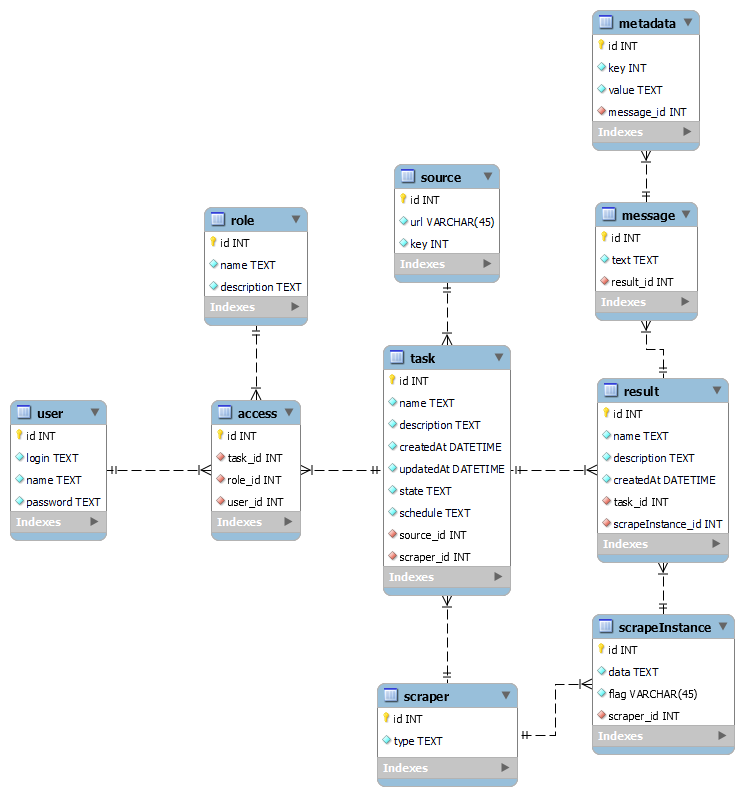

# Проєктування бази даних

В рамках проекту розробляється: 
## Модель бізнес-об'єктів 

@startuml

entity Task
entity Task.createdAt
entity Task.id
entity Task.description
entity Task.name
entity Task.updatedAt
entity Task.schedule
entity Task.state

Task.createdAt --* Task 
Task.id --* Task 
Task.description --* Task
Task.name --* Task 
Task.updatedAt --* Task 
Task.state --* Task 
Task.schedule --* Task 

entity Access

entity User
entity User.id
entity User.login
entity User.password
entity User.name

User.id -d-* User 
User.login -d-* User
User.password -d-* User 
User.name --* User 

entity Result
entity Result.id
entity Result.name
entity Result.description

Result.id --* Result 
Result.name --* Result 
Result.description -r-* Result

entity Role
entity Role.id
entity Role.name
entity Role.description
entity Role.createdAt

Role.id -u-* Role 
Role.name -u-* Role 
Role.description -u-* Role
Role.createdAt -u-* Role

entity Source
entity Source.url
entity Source.id
entity Source.key

Source.url --* Source
Source.id --* Source
Source.key --* Source

entity Scraper
entity Scraper.type
entity Scraper.id

Scraper.type -u-* Scraper
Scraper.id -u-* Scraper

entity ScraperInstance
entity ScraperInstance.id
entity ScraperInstance.data
entity ScraperInstance.flag

ScraperInstance.id -l-* ScraperInstance
ScraperInstance.data -u-* ScraperInstance
ScraperInstance.flag -u-* ScraperInstance

entity Message
entity Message.id
entity Message.data

Message.id -r-* Message
Message.data -l-* Message

entity Metadata
entity Metadata.id
entity Metadata.key
entity Metadata.value

Metadata.id -u-* Metadata
Metadata.key -u-* Metadata
Metadata.value -u-* Metadata

Task "1,1" -- "0,*" Access 
Task "0,*" -u- "1,1" Source 
Task "1,1" -- "0,*" Result 
User "1,1" -- "0,*" Access 
Role "1,1" -- "0,*" Access
Task "0,*" -- "1,1" Scraper
Scraper "1,1" - "0,*" ScraperInstance
Result "1,1" -- "0,*" Message
Message "1,1" -- "0,*" Metadata
Result "0,*" -- "1,1" ScraperInstance

@enduml

## ER-модель

@startuml 

entity Task {
  id: int
  name: text
  description: text
  createdAt: datetime
  updatedAt: datetime
  state: text "enable", "disable" ...
  schedule: text CRON formated string
  }

entity User {
  id: int
  login: text
  name: text
  password: text
}

entity Result {
  id: int
  name: text
  description: text
  createdAt: datetime
}

entity Role {
  id: int
  name: text
  description: text
}

entity Source {
  id: int
  url: uri-reference
  key: int
}

entity Scraper {
  id: int
  type: text
}

entity Access {}

entity ScraperInstance {
  id: int
  data: text
  flag: uri-reference
}

entity Message {
  id: int
  data: text
}

entity Metadata {
  id: int
  key: int
  value: text
}

Task "1,1" -l- "0,*" Access 
Task "0,*" -u- "1,1" Source 
Task "1,1" -r- "0,*" Result 
User "1,1" -- "0,*" Access 
Role "1,1" -r- "0,*" Access
Task "0,*" -- "1,1" Scraper
Scraper "1,1" - "0,*" ScraperInstance
Result "1,1" -u- "0,*" Message
Message "1,1" -u- "0,*" Metadata
Result "0,*" -- "1,1" ScraperInstance

@enduml

## Реляційна схема

  

