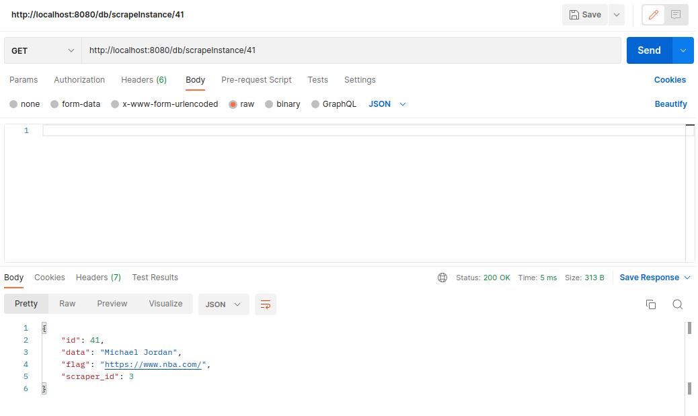

# Тестування працездатності системи

## Створення процесу scrapeInstance POST

**Запит**

**Відповідь**

## Зчитування всіх процесів scrapeInstance GET

**Запит та результат**

## Зчитування процесу scrapeInstance по ID GET

**Запит та результат**

## Зчитування scrapeInstance процесу по ID, що не існує GET

**Запит та результат**

## Оновлення scrapeInstance процесу PUT

**Запит**

**Результат**

## Видалення scrapeInstance процесу DELETE

**Запит та результат**

